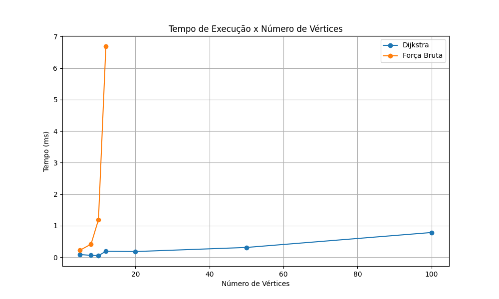
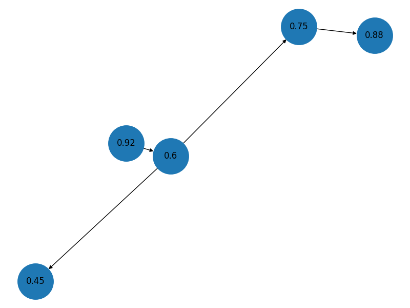

# Global Solution 2026 – Estruturas de Dados e Algoritmos

## Integrantes

* Áurea Sardinha Carminato - RM563837
* Eduarda de Castro Coutinho dos Santo - RM562184
* Mariana Souza França - RM562353
* Thomas Soares Sievers - RM563566

---

# 1. Contextualização e Cenário Brasileiro Escolhido

O monitoramento ambiental é uma atividade fundamental para prevenção de queimadas, desmatamento e outros impactos relacionados às mudanças climáticas. Neste projeto foram aplicadas estruturas de dados e algoritmos para representar municípios, analisar níveis de risco e comparar estratégias de busca de caminhos em grafos.

O cenário escolhido foi o **Cenário D – Rotas de Brigadas de Fiscalização na Amazônia**. Nesse contexto, os municípios representam áreas monitoradas por órgãos ambientais e as arestas representam rotas de deslocamento utilizadas por equipes de fiscalização. O objetivo é priorizar municípios com maior índice de risco e determinar caminhos eficientes para atendimento.

A proposta está alinhada aos Objetivos de Desenvolvimento Sustentável da ONU, especialmente:

* ODS 9 – Indústria, Inovação e Infraestrutura;
* ODS 11 – Cidades e Comunidades Sustentáveis;
* ODS 13 – Ação Contra a Mudança Global do Clima.

---

# 2. Modelagem e Estruturas de Dados

## Grafo

Foi utilizada uma lista de adjacência para representar conexões entre municípios.

Cada município foi representado por uma tupla contendo:

```python
(id, nome, indice_risco, custo_atendimento, populacao)
```

As arestas armazenam as conexões entre municípios e seus respectivos custos de deslocamento.

A utilização de lista de adjacência foi escolhida por apresentar menor consumo de memória quando comparada à matriz de adjacência, especialmente em grafos esparsos.

## Árvore Binária de Busca (BST)

Foi utilizada uma Árvore Binária de Busca para armazenar municípios ordenados pelo índice de risco.

A BST implementada suporta:

* Inserção de municípios;
* Busca por intervalo de risco;
* Percurso em ordem crescente;
* Cálculo da altura da árvore;
* Remoção de nós.

## Estruturas Auxiliares

| Estrutura  | Utilização                                               |
| ---------- | -------------------------------------------------------- |
| Lista      | Lista de adjacência e armazenamento de caminhos          |
| Tupla      | Representação dos municípios e arestas                   |
| Dicionário | Armazenamento de adjacências, distâncias e predecessores |
| Set        | Controle de vértices visitados                           |
| Heap       | Fila de prioridade do algoritmo de Dijkstra              |
| BST        | Organização dos municípios por risco                     |
| Grafo      | Modelagem das rotas entre municípios                     |

---

# 3. Complexidade dos Algoritmos

## Força Bruta

O algoritmo de Força Bruta foi implementado utilizando backtracking recursivo.

Todos os caminhos possíveis entre origem e destino são avaliados para encontrar a solução ótima.

Complexidade:

* Tempo: O(n!)
* Espaço: O(n)

O crescimento exponencial torna essa abordagem inviável para instâncias maiores.

## Dijkstra

O algoritmo de Dijkstra foi utilizado como solução gulosa para determinação do caminho mínimo.

Utilizando uma fila de prioridade baseada em heap, apresenta:

* Tempo: O((V + E) log V)
* Espaço: O(V)

Essa abordagem apresenta desempenho eficiente mesmo para grafos maiores.

---

# 4. Resultados

Foram realizados testes experimentais utilizando instâncias com diferentes tamanhos, variando de 5 a 100 vértices.

| Número de Vértices | Força Bruta (ms) | Dijkstra (ms) |
| ------------------ | ---------------- | ------------- |
| 5                  | 0.221            | 0.086         |
| 8                  | 0.415            | 0.059         |
| 10                 | 1.191            | 0.050         |
| 12                 | 6.689            | 0.188         |
| 20                 | N/A              | 0.180         |
| 50                 | N/A              | 0.310         |
| 100                | N/A              | 0.784         |

## Figura 1 – Tempo de Execução × Número de Vértices



**Fonte:** Resultados produzidos pelos autores.

**Interpretação:** O gráfico demonstra que o algoritmo de Força Bruta apresenta crescimento acelerado do tempo de execução à medida que o tamanho da instância aumenta. Entre 10 e 12 vértices observa-se aumento significativo no custo computacional, caracterizando a explosão combinatória. Em contrapartida, o algoritmo de Dijkstra manteve comportamento estável em todas as instâncias avaliadas, demonstrando melhor escalabilidade para aplicações reais.

## Figura 2 – Representação da BST



**Fonte:** Resultados produzidos pelos autores.

**Interpretação:** A árvore binária de busca organiza os municípios de acordo com seus índices de risco. Essa estrutura permite consultas eficientes por faixa de criticidade, além de possibilitar a priorização de regiões mais vulneráveis. A ordenação natural da BST facilita operações de busca e classificação dos municípios monitorados.

## Figura 3 – Visualização do Grafo


**Fonte:** Resultados produzidos pelos autores.

**Interpretação:** O grafo representa as conexões entre municípios e as possíveis rotas de deslocamento utilizadas pelas equipes de fiscalização. As arestas armazenam os custos de deslocamento entre vértices, permitindo a aplicação de algoritmos de caminho mínimo. Essa modelagem aproxima o problema computacional de um cenário real de monitoramento ambiental.

---

# 5. Escala de Decisão

A escala de decisão foi construída considerando qualidade da solução, custo computacional e aplicabilidade prática.

| Nível     | Qualidade          | Custo Computacional | Aplicação       |
| --------- | ------------------ | ------------------- | --------------- |
| Excelente | Gap = 0%           | Baixo               | Produção        |
| Bom       | Gap até 5%         | Médio               | Produção        |
| Regular   | Gap entre 5% e 15% | Médio               | Apoio à decisão |
| Ruim      | Gap acima de 15%   | Alto                | Não recomendado |

Nos experimentos realizados, o algoritmo de Dijkstra encontrou as mesmas soluções obtidas pela Força Bruta para as instâncias testadas, apresentando gap de otimalidade igual a 0%.

Os resultados demonstram que o algoritmo guloso oferece excelente equilíbrio entre qualidade da solução e custo computacional, sendo mais adequado para cenários reais com grande volume de dados.

---

# 6. Conclusão

O projeto permitiu aplicar conceitos fundamentais de Estruturas de Dados e Algoritmos por meio da implementação de grafos, árvores binárias de busca, heaps, conjuntos e dicionários.

A comparação entre os algoritmos evidenciou que abordagens exaustivas apresentam limitações práticas devido ao crescimento exponencial do custo computacional. Em contraste, o algoritmo de Dijkstra demonstrou desempenho consistente mesmo em instâncias significativamente maiores.

Os resultados obtidos indicam que algoritmos gulosos representam uma alternativa eficiente para sistemas de monitoramento ambiental, possibilitando respostas rápidas e escaláveis para cenários reais.

Além disso, o projeto contribui para os Objetivos de Desenvolvimento Sustentável 9, 11 e 13, ao propor soluções tecnológicas voltadas ao monitoramento ambiental e à mitigação dos impactos das mudanças climáticas.

---

# 7. Referências

FIAP. Global Solution 2026 – Economia Espacial – Dynamic Programming.

Cormen, T.; Leiserson, C.; Rivest, R.; Stein, C. Introduction to Algorithms. MIT Press.

Sedgewick, R.; Wayne, K. Algorithms. Addison-Wesley.

INPE – Instituto Nacional de Pesquisas Espaciais.

IBGE – Instituto Brasileiro de Geografia e Estatística.
